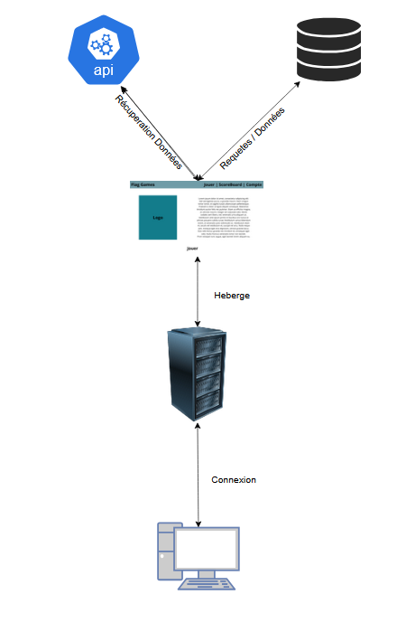

# Flag Game
## Description
Notre application est un site web qui utilise une API de drapeau avec des logs dans le cadre du M110.

## Fonctionnalités
- Connection et création de compte
- Accès au quiz
- Accès au score / scoreboard
- Possibilité de changer de mot de passe

## Architecture

## Descriptif (fiabilité)

## Valeurs limites

## Conclusion
